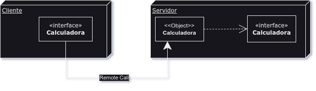

# Calculadora RMI

## Objetivo
Desenvolver um ' hello world' usando java RMI (Remote Method Invocation),

## Descrição
Esse programa é bem simples apenas uma calculadora que soma, subtrai e calcula fatoriais contudo
a foma de invocação do método é remota isto é, não é o mesmo programa java ( mesma jvm), o programa cliente está usando
o objeto que se encontra no programa servidor.

## Desenvolvimento

Nosso objetivo é transformar esse diagrama em código, mão na massa.

Dentro da pasta src ficou as seguintes classes:

 - [Cliente.java](#clientejava)
 - [Servidor.java]()
 - [Calculadora.java]()
 - [CalculadoraImpl.java]()

Usando a seguinte hierarquia de modulos:

```yml
    src:
      java:
        - Cliente.java
        - Servidor.java
        - rmi:
          objects:
            - Calculadora.java
            - impl:
              - CalculadoraImpl.java
```
### Cliente.java


